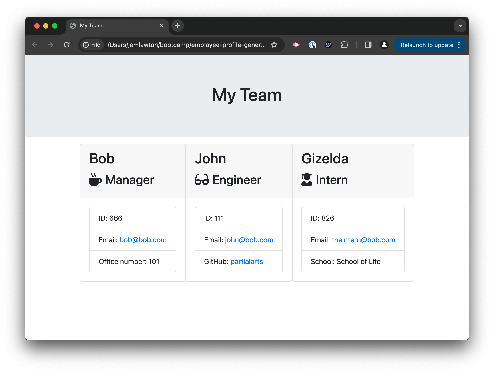
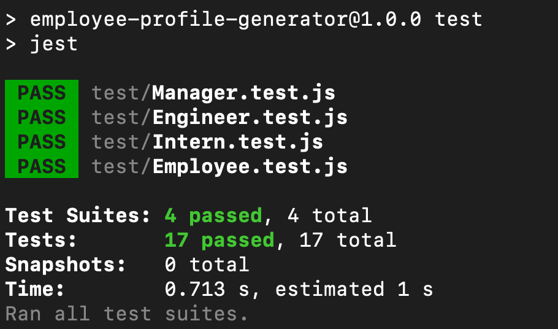

# Emoloyee Profile Generator

## Description

The purpose of this project was to build a command line application that dynamically generates a team profile webpage using a series of prompts using the Inquirer package.

The application starts with adding a Manager, and then Engineers and Interns can also be added. A card will be generated for each team member, and team members can continue to be added until complete.

## Table of Contents

- [Description](#description)
- [Installation](#installation)
- [Usage](#usage)
- [Screenshot](#screenshot)
- [Testing](#testing)
- [License](#license)

## Installation

In your terminal, run the following commands:
```
git clone git@github.com:partialarts/employee-profile-generator.git
cd employee-profile-generator
npm install
```

## Usage

Navigate to the directory of `index.js` in terminal and run the following command:
```
node index,js
```
A series of prompts will guide you through the process of generating the team profile. The finished product will appear in the `Output` folder.

## Screenshot



## Testing

Tests were provided using Jest and the application passes all of these.



## License

MIT

[](https://opensource.org/licenses/MIT)
